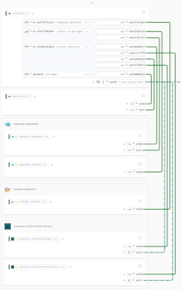
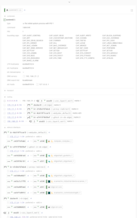

[](https://github.com/siemens)
[](https://github.com/industrial-edge)
[](https://github.com/siemens/edgeshark)

# Edgeshark

[](https://siemens.github.io/edgeshark)

[](docs/_images/teaser-wiring.png)
[](docs/_images/teaser-comm-details.png)

Discover the virtual communication of containers in
([Docker](https://docker.com)) container hosts, such as the [Siemens Industrial
Edge](https://github.com/industrial-edge). And capture container traffic live
from the comfort of your Desktop's [Wireshark](https://wireshark.org) with a
simple click. Edgeshark additionally is
[KinD](https://github.com/kubernetes-sigs/kind)-aware and supports further
container engines, such as containerd.

Learn more about what Edgeshark has on offer from our [Edgeshark online
manual](https://siemens.github.io/edgeshark).

## Quick Start

- plain [Docker Host](#docker-host) with `docker compose` v2
- plain [Docker Host Without Composer](#docker-host-without-composer) without Docker composer
- [Siemens Industrial Edge](#siemens-industrial-edge)

### Docker Host

We provide multi-architecture Docker images for `linux/amd64` and `linux/arm64`.
First, ensure that you have the Docker _compose_ plugin v2 installed. For Debian
users it is strongly recommended to install docker-ce instead of docker.io
packages, as these are updated on a regular basis.

```bash
wget -q --no-cache -O - \
  https://github.com/siemens/edgeshark/raw/main/deployments/wget/docker-compose.yaml \
  | docker compose -f - up
```

Finally, visit http://localhost:5001 and start looking around your container
host virtual networking.

> ⚠ This quick start deployment will **expose TCP port 5001** also to clients
> external to your host. Make sure to have proper network protection in place.

If you want to live capture traffic using Wireshark, please [download the csharg
extcap plugin](https://github.com/siemens/cshargextcap/releases) for the
OS/distribution and install it. 

### Docker Host Without Composer

```bash
wget -q --no-cache -O - \
  https://github.com/siemens/edgeshark/raw/main/deployments/nocomposer/edgeshark.sh \
  | bash -s up
```

### Siemens Industrial Edge

Please head over to our
[releases](https://github.com/siemens/edgeshark/releases) page to download the
latest (and greatest) Edgeshark app (amd64 only at this time):

1. download the `edgeshark.zip` file.
2. unpack the downloaded ZIP archive.
3. import the `edgeshark.app` file into the catalog of your IEM.
4. deploy ... and enjoy!

If you want to live capture traffic using Wireshark, please [download the csharg
extcap plugin](https://github.com/siemens/cshargextcap/releases) for the
OS/distribution and install it. 

## Project Structure

The "Edgeshark" project consist of several repositories:
- 🖝 **Edgeshark Hub repository** 🖜
- [G(h)ostwire discovery service](https://github.com/siemens/ghostwire)
- [Packetflix packet streaming service](https://github.com/siemens/packetflix)
- [Containershark Extcap plugin for
  Wireshark](https://github.com/siemens/cshargextcap)
- support modules:
  - [csharg (CLI)](https://github.com/siemens/csharg)
  - [mobydig](https://github.com/siemens/mobydig)
  - [ieddata](https://github.com/siemens/ieddata)

## Working on the Manual

The Edgeshark manual uses [docsify](https://docsify.js.org/) so there is no need
for processing the documentation files first. Instead, they can be directly
copied one-to-one to a place from where they can be served as-is, such as the
[Edgeshark live manual on github.com](https://siemens.github.io/edgeshark).

When working on the documentation, simply serve the manual artifacts as-is in
order to see an automatically updating live "preview" (which actually is quite
"what you see is what you get" in this case):

```bash
make docsify
```

When updating or adding icons in `icons/_media/icons`, make sure to optimize and
sync them to `docs/_media/icons`:

```bash
sudo npm -g install svgo
make icons
```

**Do not edit** the icons in `docs/_media/icons`; edit only the "source" icons
in `icons/_media/icons`.

# Contributing

Please see [CONTRIBUTING.md](CONTRIBUTING.md).

## License and Copyright

(c) Siemens AG 2023

[SPDX-License-Identifier: MIT](LICENSE)
