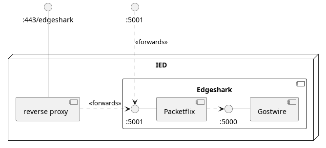

<!-- markdownlint-disable MD029 -->
# Getting Started

**Edgeshark** consists of
1. two containerized 🛎 services named
   [Ghostwire](https://github.com/siemens/ghostwire) and
   [Packetflix](https://github.com/siemens/packetflix),
2. and an _optional_ Wireshark ⚙️ [csharg external capture
   plugin](https://github.com/siemens/cshargextcap) for live remote capture of
   network traffic.

## Service Deployment

We provide multi-architecture Docker images for the `linux/amd64` and
`linux/arm64` architectures.

> [!ATTENTION] Make sure you have a Linux kernel of at least version 4.11
> installed, however we highly recommend at least kernel version 5.6 or later.

<!-- tabs:start -->

#### **Docker Compose v2**

First, ensure that you have the Docker compose plugin v2 installed: `docker
compose version` should display the compose plugin version, but not any error.
For Debian users we recommend installing `docker-ce` instead of `docker.io`
packages, as the `docker-ce` packages are updated on a regular basis.

Then copy and paste the following command into a terminal to deploy the
Edgeshark services:

```bash
wget -q --no-cache -O - \
  https://github.com/siemens/edgeshark/raw/main/deployments/wget/docker-compose-localhost.yaml \
  | DOCKER_DEFAULT_PLATFORM= docker compose -f - up
```

Finally, visit http://localhost:5001 and start looking around your container
host virtual networking.

> [!NOTE] Using `DOCKER_DEFAULT_PLATFORM=` ensures that our multi-arch images
> are correctly deployed and especially avoids problems with Apple's Rosetta not
> being able to work with read-only image deployments.

> [!WARNING] The following quick start deployments will **expose TCP port 5001**
> (or 5500) also to clients external to your host. Make sure to have proper
> network protection in place.

In case you need to expose service TCP port 5001 to external clients then copy,
paste, and execute this command instead:

```bash
wget -q --no-cache -O - \
  https://github.com/siemens/edgeshark/raw/main/deployments/wget/docker-compose.yaml \
  | DOCKER_DEFAULT_PLATFORM= docker compose -f - up
```

In case port 5001 is already in use, either deploy directly the following
alternative composer file, or download and edit it before deploying:

```bash
wget -q --no-cache -O - \
  https://github.com/siemens/edgeshark/raw/main/deployments/wget/docker-compose-5500.yaml \
  | DOCKER_DEFAULT_PLATFORM= ocker compose -f - up
```

This exposed Edgeshark on host port 5500 instead.

#### **Docker Bash**

In case your particular system doesn't support Docker compose v2, we provide a
simple fallback using a plain `bash` script.

```bash
wget -q --no-cache -O - \
  https://github.com/siemens/edgeshark/raw/main/deployments/nocomposer/edgeshark.sh \
  | DOCKER_DEFAULT_PLATFORM= bash -s up
```

The bash script takes a single argument, either `up` or `down`.

Finally, visit http://localhost:5001 and start looking around your container
host virtual networking.

> [!WARNING] This quick start deployment will **expose TCP port 5001** also to
> clients external to your host. Make sure to have proper network protection in
> place.

#### **Industrial Edge**

1. Download the [latest Edgeshark app `.zip`
   file](https://github.com/siemens/edgeshark/releases/latest) from the releases
   section of this project. At the moment, we provide only app files for the
   `linux/amd64` platform (a.k.a. `linux/x86-64`).

2. Unpack the contained `edgeshark.app` file inside the `.zip` archive.

3. Import the Edgeshark app file `edgeshark.app` into your IEM
   Industrial Edge Management system.

4. Go to the catalog of your IEM and deploy/install the Edgeshark app onto your IED
   Industrial Edge Device(s).

  > [!WARNING] The Edgeshark UI and services are exposed on port 5001 on your
  > IED hosts **without any user authorization**. This is required in order to
  > support initiating remote packet captures from the user interface. (There's
  > nothing we can do until the IED-OS starts supporting session hand-overs from
  > a user web browser to an external application.)

5. Navigate your browser to port HTTP 5001 on your IED:
   `http://`_ied-ip-address_`:5001` (please make sure to use `http:` and **not**
   `https:`). You should now see the "Edgeshark" user interface.

   > [!NOTE] You can use the remote access and then click on or touch the
   > Edgeshark app tile in the IED user interface. However, you cannot use
   > remote access to start remote captures (due to the aforementioned IED-OS
   > limitation).

<!-- tabs:end -->

Please see [Getting around](getting-around) for a tour of the user interface.

Deploying Edgeshark creates the two services named packetflix and gostwire, and
expose **port 5001** on the host as shown below. Please note that access via the
Industrial Edge device reverse proxy is specific to this platform. 



## Optional Capture Plugin

Please note that you only need to install the external capture plugin
"[cshargextcap](https://github.com/siemens/cshargextcap)" for Wireshark if you
intend to live capture container network traffic. Otherwise, you can completely
ignore this section.

<!-- tabs:start -->

#### **Windows 64bit**

We offer a Windows 64 bit installer for the `amd64` (`x86-64`) platform only.

1. Make sure that you have a sufficiently recent [Wireshark (64
   bit)](https://wireshark.org) installed. At least version 3.0.2 or later is
   required, as otherwise the plugin won't work correctly due to bugs in
   Wireshark. Wireshark 4.x is also supported.

2. [Download the latest Windows
   installer](https://github.com/siemens/cshargextcap/releases/latest) `.zip`
   file from the releases page of the siemens/csharkextcap project.

3. Double click on the downloaded `.zip` file to view its contents and then
   simply run the included installer executable inside it. Next, follow the
   on-screen instructions of the installer.

4. In Edgeshark's web UI simply click on one of the Wireshark fin buttons to
   start a Wireshark capture session.

#### **Linux 64bit**

We offer distribution-specific packages in `.apk`, `.deb`, and `.rpm` formats
for both `amd64` and `arm64` architectures.

1. install Wireshark from your distribution repositories and allow it to be used
   by non-root users.
2. [add your user to the wireshark group](https://askubuntu.com/a/461037) (ask
   Ubuntu):

   ```bash
   sudo gpasswd -a $USER wireshark
   ```

   This is necessary so that Wireshark can correctly execute `dumpcap` for your
   non-root user in order to use the external capture plugin.
3. log out of your session and then in again so that the new group assignment
   takes effect.
4. [Download the latest plugin package](https://github.com/siemens/cshargextcap/releases/latest) suitable for your distribution and CPU architecture.
5. install the downloaded plugin package.
6. _optionally:_ start Wireshark to verify that the plugin was correctly
   detected and queried: three new external capture targets should have been
   added ("Docker host capture" and "packetflix:// remote cluster and container
   host capture").

   
7. In Edgeshark's web UI simply click on one of the Wireshark fin buttons to
   start a Wireshark capture session.

#### **macOS 64bit**

We support both the `arm64` ("Apple Silicon") and `amd64` (Intel) architectures
on macOS.

1. [Download the latest plugin
   package](https://github.com/siemens/cshargextcap/releases/latest) suitable
   for macOS on ARM or AMD (Intel) 64bit.

2. extract the contained `cshargextcap` plugin binary.

3. copy/move the plugin binary into
   `/Applications/Wireshark.app/Contents/MacOS/extcap`.

4. download `packetflix-handler.zip` from the same release page.

5. run the CLI command `xattr -d com.apple.quarantine packetflix-handler.zip`.

6. unpack `packetflix-handler.zip` by double clicking it in Finder.

7. copy the unpacked `packetflix-handler` (actually a folder with its `.app`
   hidden) to your Applications folder, `/Applications`.

8. go to "System Preferences" > "Security and Privacy" > tab "General" or
   "Security" section. Allow the packetflix-handler. In case you don't see
   anything here, try to start a capture from the web UI first, and as this will
   be blocked, you should now see here a notice with a button to enable the
   packetflix-handler.

9. navigate to the Edgeshark web UI at `http://localhost:5001`.

10. click on a fin button to start a live packet capture using Wireshark.

<!-- tabs:end -->

Please see [Capturing](capture) for how to capture container network traffic
using Wireshark with Edgeshark.
