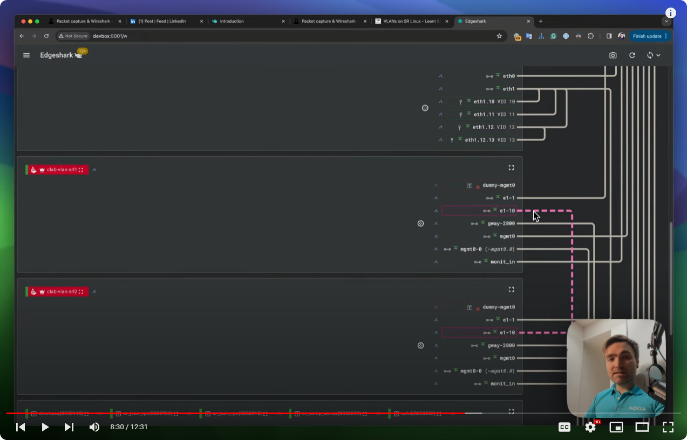
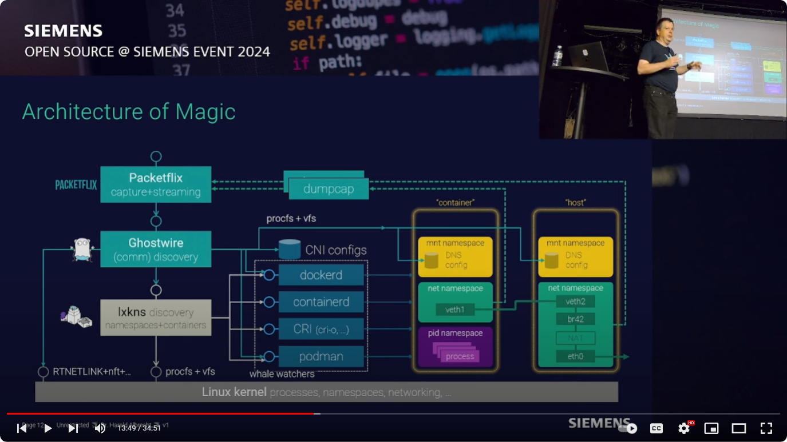

# On the Tube

Recorded Edgeshark talks.

## SharkFest'23 Brussels

Walkthrough "lesson", with additional background information on the virtual
network elements used in Docker networking. [1h 6mins]

## Edgeshark & Containerlab

Roman Dodin's user testimonial and Edgeshark introduction, with the focus on
quick deployment and starting captures from the Edgeshark web UI. Roman is a
product line manager at Nokia and a vivid [containerlab supporter and
promoter](https://containerlab.dev/). [12mins]

## Architecture of Magic

A more thorough look below the surface into how Edgeshark actually works. [34mins]

