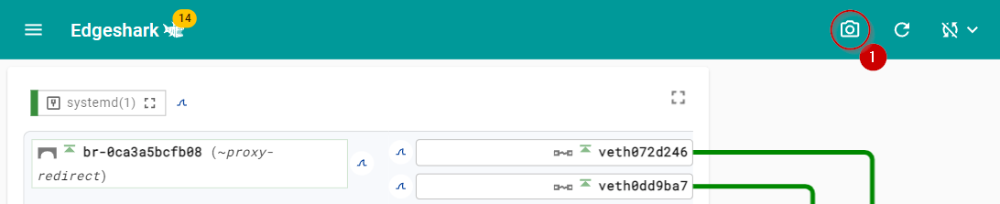
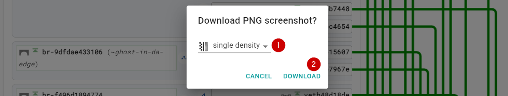
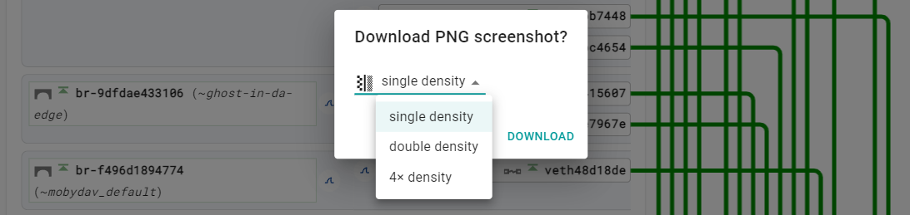

# Snapshot

Do you need to document the virtual wiring or the communication configuration of
your Industrial Edge or one of its apps? No worries about blocked screenshot
browser plugins. Edgeshark has all that covered for you.

Just click or tap the  symbol ❶ in the action bar.

This brings up a confirmation dialog to download a screenshot ❷ of the current
Edgeshark display. Additionally, click or tap the screen density selection ❶ to
choose between different screenshot densities before downloading a screenshot.

## Snapshot Density

A **single density** screenshots is a pixel-perfect PNG image of the current
Edgeshark display. A **double density** screenshot contains twice the horizontal
and vertical number of pixels when compared to the current display. Similar,
**quadruple density** screenshots feature fourth times the horizontal and
vertical number of pixels compared to the current display. Higher density
screenshots might be useful for higher quality documentation, especially when
zooming and cropping them.

The density setting is remembered for a specific host between different sessions
in the same browser. (The setting is stored in the browser's site storage.)
